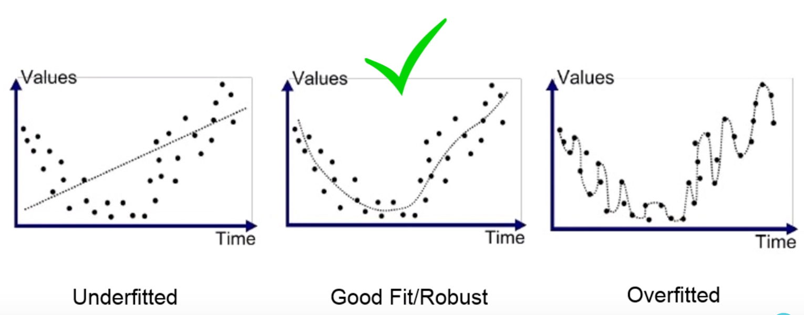
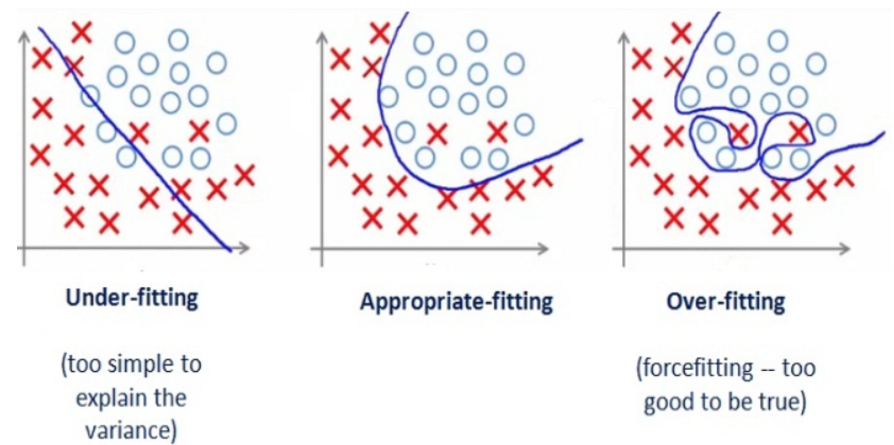

## HOWTO ML


#### Setup env

```text
python --version
Python 3.7.1
```

```html
https://matplotlib.org/faq/installing_faq.html
http://www.numpy.org/
```

```text
./python3.7 -m pip install matplotlib
./python3.7 -m pip install pandas
./python3.7 -m pip install sklearn
./python3.7 -m pip install numpy

```

#### dataset can be downloaded by the next link 
```html
https://www.superdatascience.com/pages/machine-learning
```


#### Configure project with intelliJ IDEA

```text
File -> Project structure -> set SDK - Python 3.7
File -> Project Structure -> Project -> Project SDK -> Python 3.7 
```

### Theory


anomaly detection

The rule of thumb is the more complex the data, the more complex the algorithm.
For text, numbers, and tables, I'd choose the classical approach.
For pictures, video and all other complicated big data things, I'd definitely look at neural networks.


Unsupervised learning

***Clustering***

    For market segmentation (types of customers, loyalty)
    To merge close points on a map
    For image compression
    To analyze and label new data
    To detect abnormal behavior

***Dimensionality Reduction (Generalization)***

    Recommender systems (★)
    Beautiful visualizations
    Topic modeling and similar document search
    Fake image analysis
    Risk management

***Association rule learning***

    To forecast sales and discounts
    To analyze goods bought together
    To place the products on the shelves
    To analyze web surfing patterns
    
***Reinforcement Learning***

    Self-driving cars
    Robot vacuums
    Games
    Automating trading
    Enterprise resource management
    
***Ensemble Methods***

    Everything that fits classical algorithm approaches (but works better)
    Search systems (★)
    Computer vision
    Object detection
    
    
***Neural Networks and Deep Leaning***

    Replacement of all algorithms above
    Object identification on photos and videos
    Speech recognition and synthesis
    Image processing, style transfer
    Machine translation
    
         

#### Intro 

```html
https://vas3k.com/blog/machine_learning/
https://medium.com/machine-learning-for-humans

http://www.asimovinstitute.org/neural-network-zoo/
https://habr.com/en/company/wunderfund/blog/313696/


```


#### Statistical Fit

Statistical speaking how well our model fit to data set such that it gives proper accurate results as expected.


#### Overfitting and Underfitting

In order to talk about underfitting vs overfitting, we need to start with the basics:
what is a model? A model is simply a system for mapping inputs to outputs. 
For example, if we want to predict house prices, we could make a model that takes in the square footage 
of a house and outputs a price. A model represents a theory about a problem: 
there is some connection between the square footage and the price and we make a model to learn that relationship.
Models are useful because we can use them to predict the values of outputs for new data points given the inputs.

**A model learns relationships between the inputs, called features, and outputs, called labels**, from a training dataset.
During training the model is given both the features and the labels and learns how to map the former to the latter. 
A trained model is evaluated on a testing set, where we only give it the features and it makes predictions. 
We compare the predictions with the known labels for the testing set to calculate accuracy. 
Models can take many shapes, from simple linear regressions to deep neural networks,
but all supervised models are based on the fundamental idea of learning **relationships between inputs and outputs 
from training data.**






**Underfitting** - does not cover all the points shown in the graph

**High Variance/Over-fitting** - the predicted line into the graph covers all points which are noise and outlier. 
Predict poor result due to its complexity.

**Appropriate-fitting** - covers majority of the point in graph and also maintains the balance between bias and variance.  


```html
https://medium.com/greyatom/what-is-underfitting-and-overfitting-in-machine-learning-and-how-to-deal-with-it-6803a989c76
```


#### Training and Testing Data

Simple dataset with x-values (features) and y-values (labels)
An important part of our data generation is adding random noise to the labels. 
In any real-world process, whether natural or man-made, the data does not exactly fit to a trend. 
There is always noise or other variables in the relationship we cannot measure. 
In the house price example, the trend between area and price is linear,
but the prices do not lie exactly on a line because of other factors influencing house prices.

After creating the data, we split it into random training and testing sets. 
The model will attempt to learn the relationship on the training data and be evaluated on the test data.
In this case, 70% of the data is used for training and 30% for testing.


ML is best understood as approximating a target function (f) 
that maps input variables (X) to an output variable (Y).

Y = f(X)

The goal of a ML model is to generalize well from the training data to any data from the problem domain.

learning model learns and generalizes to new data, namely overfitting and underfitting.

Overfitting and underfitting are the two biggest causes for poor performance of machine learning algorithms.


