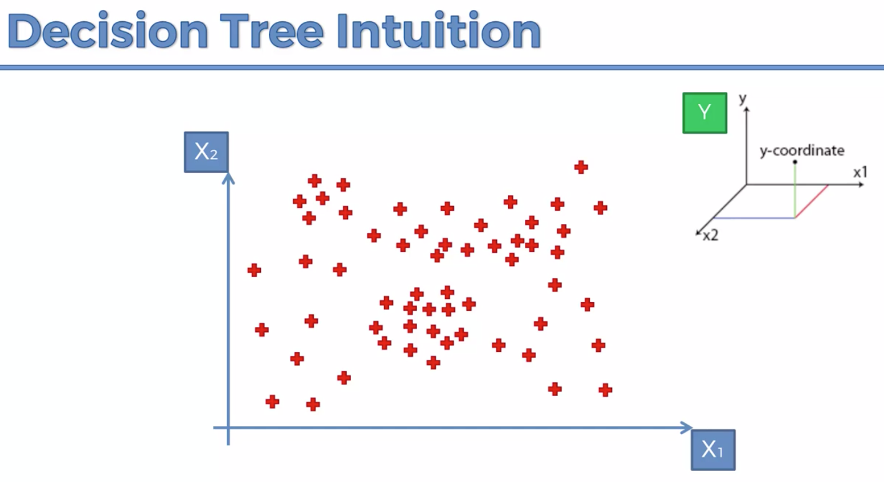
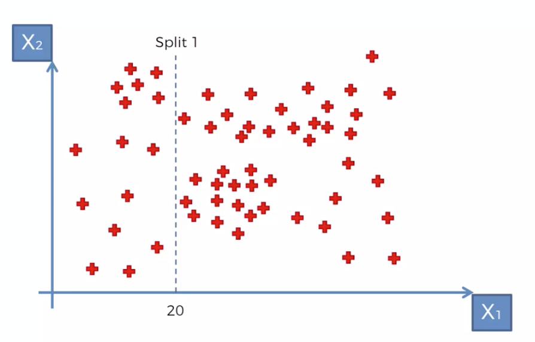
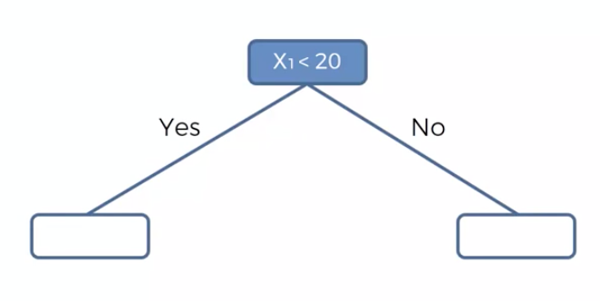
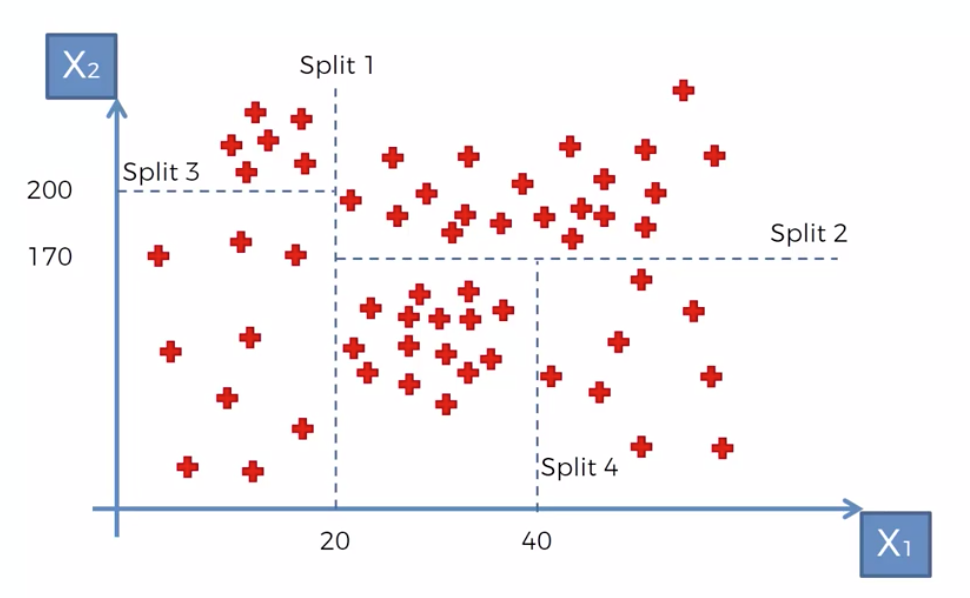
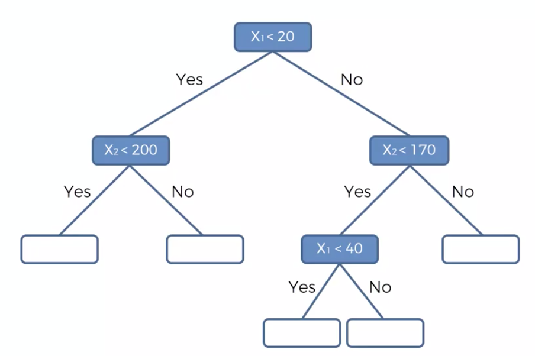

### Decision tree regression 




Divide information entropy to the subsets.    


Build the tree. Finding the optimal splits for defining optimal leafs
 


 





The next step is predict 'y' by 'x1' and 'x2'


```html
https://towardsdatascience.com/decision-trees-in-machine-learning-641b9c4e8052
```


