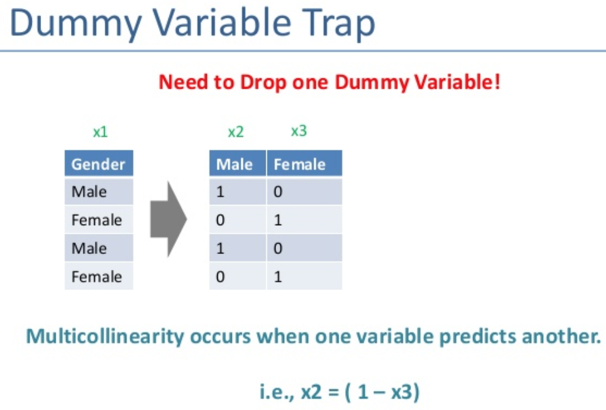

### Multiply linear regression demo

pip install statsmodels --upgrade

##### Several independent variables.
Multiple regression analysis is a powerful technique used for predicting the unknown value of a variable
from the known value of two or more variables also called the predictors.

More precisely, multiple regression analysis helps us to predict the value of Y for given values of X1, X2, …, Xk.

##### Example 1:
Salary is predicted on years of experience, worked hours, certifications earned and job role.


##### Example 2:
The yield of rice per acre depends upon quality of seed, fertility of soil, fertilizer used, temperature, rainfall. 
If one is interested to study the joint affect of all these variables on rice yield

##### Dependent and Independent Variables

By multiple regression, we mean models with just one dependent and two or more independent (exploratory) variables. 
The variable whose value is to be predicted is known as the dependent variable and the ones whose known values are used
for prediction are known independent (exploratory) variables.

#### Dummy variables

A dummy variable (aka, an indicator variable) is a numeric variable that represents categorical data,
such as gender, race, political affiliation, etc.


#### Dummy variable trap 

is a scenario in which the independent variables are multi-collinear - two or more variables are highly correlated.

Example consider the case of gender having two values male (0 or 1) and female (1 or 0). 
Including both the dummy variable can cause redundancy because if a person is not male
in such case that person is a female, hence, we don’t need to use both the variables in regression models.
This will protect us from dummy variable trap.




#### What is a p-value
P value is a statistical measure that helps scientists determine whether or not their hypotheses are correct.

```html
https://www.mathbootcamps.com/what-is-a-p-value/
https://www.wikihow.com/Calculate-P-Value
```


#### Select independent variables (x1, x2, ,n) and building a model
1. All-in
2. Backward Elimination
3. Forward selection
4. Bidirectional elimination
5. Score Comparison  

```html
https://www.geeksforgeeks.org/ml-dummy-variable-trap-in-regression-models/
```
