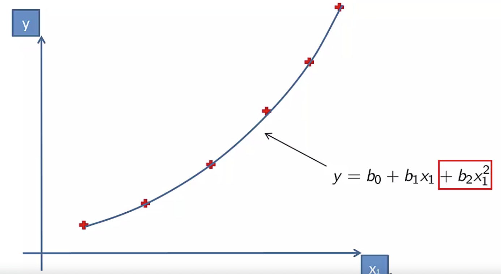
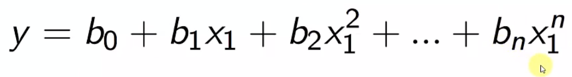
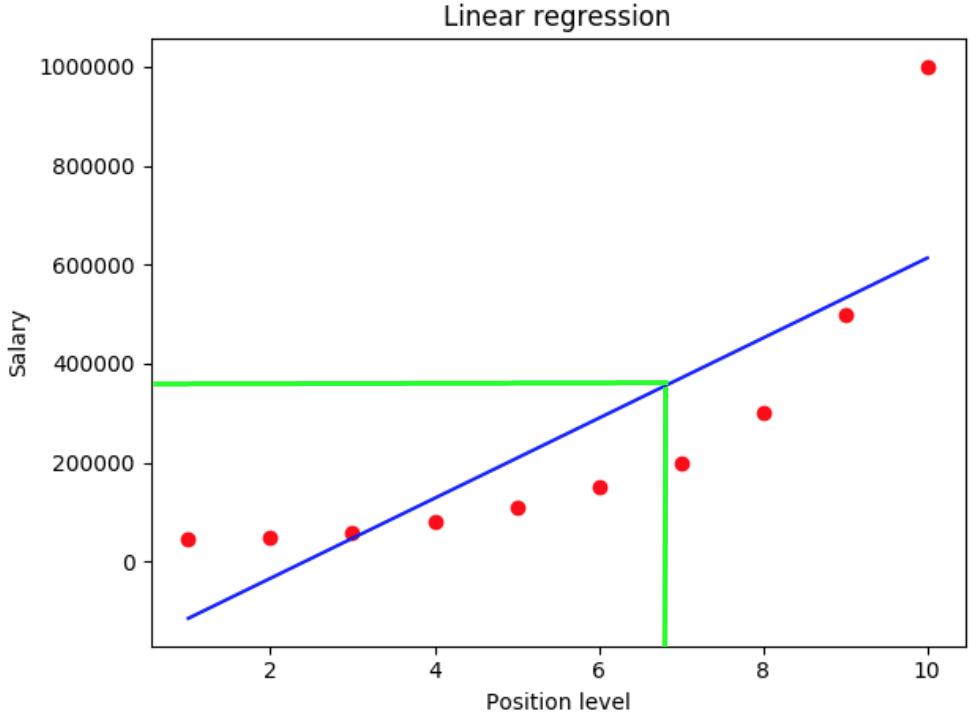
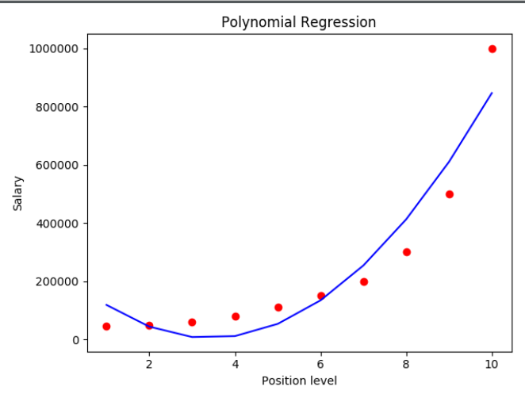
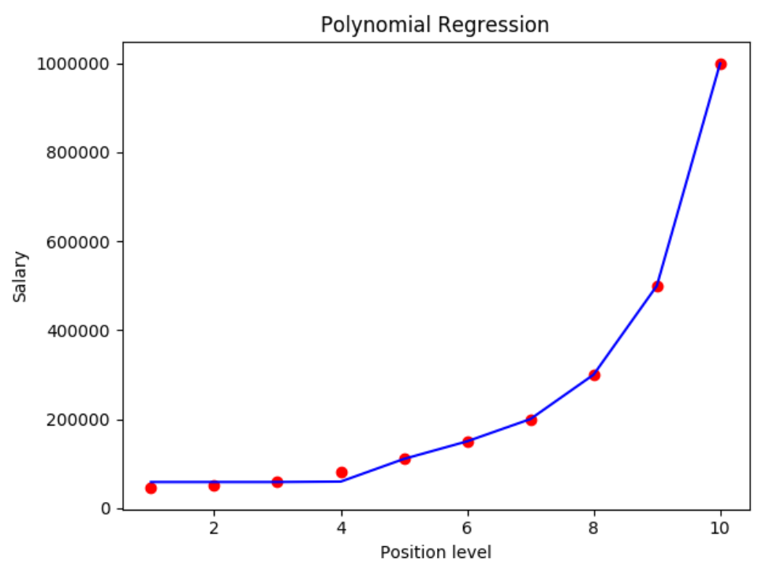

### Polynomial regression demo

 

Main formula

```text
y - dependent 
β0 - starting point
β1 - slope
x - independent
```



Analyze data set with simple linear regression 

As you can see the prediction is not accurate as well


```python
poly_reg = PolynomialFeatures(degree=2)
```
This is why for growing data by exponent will be better to use polynomial regression. 



With specific degree customization, we can manage our prediction line
```python
poly_reg = PolynomialFeatures(degree=30)
```



### Why is it steel linear ?
 
