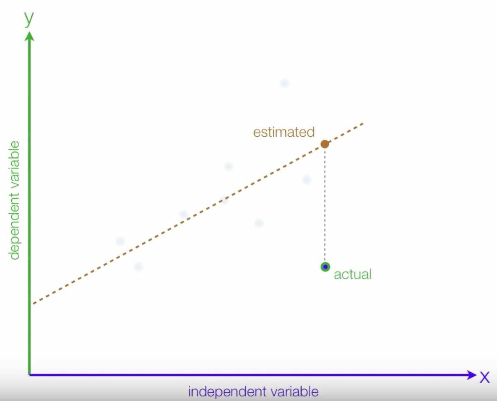
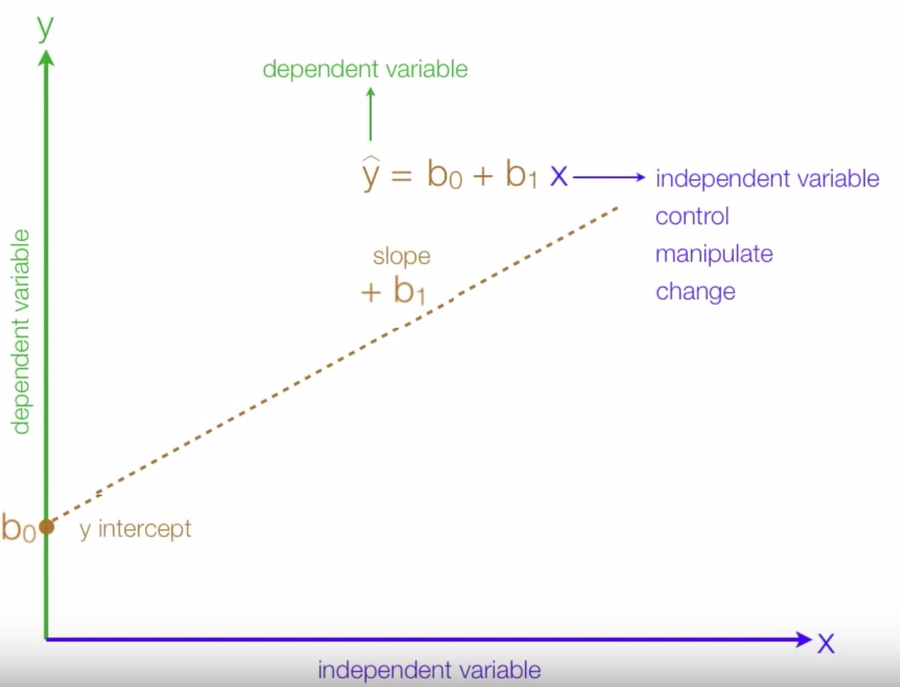
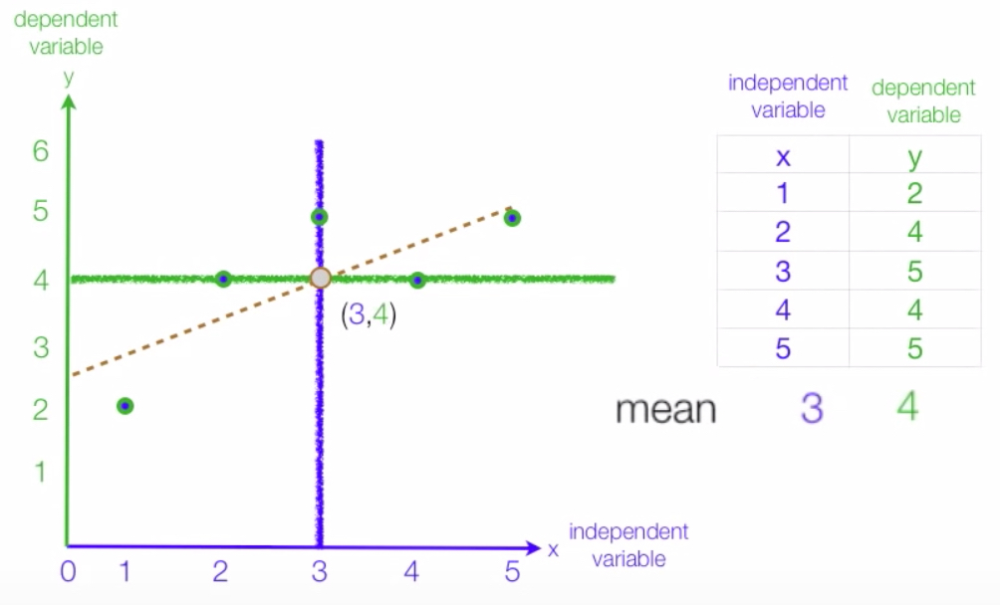
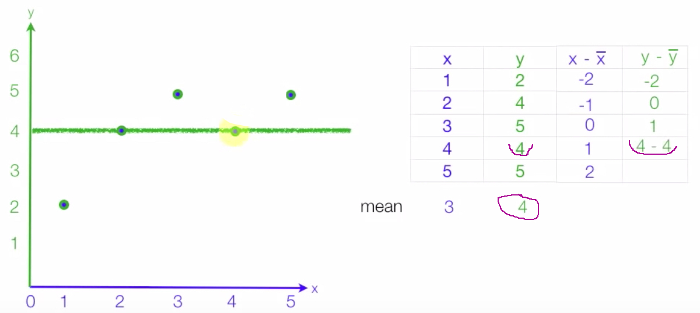
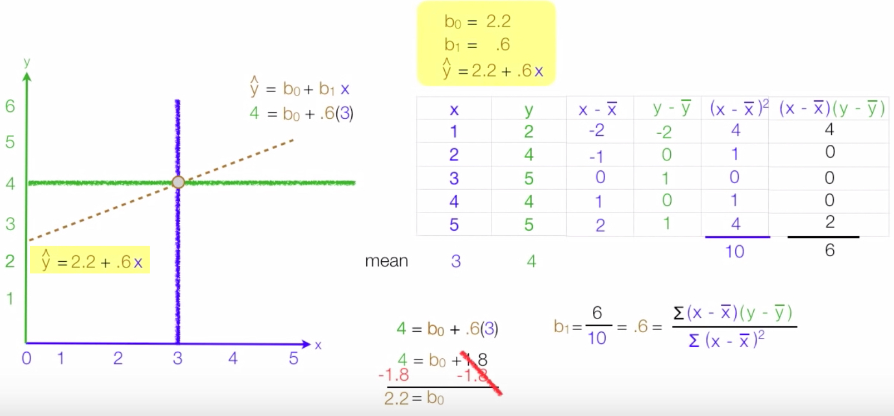

### Simple linear regression demo

```text
Simple linear regression gets its adjective "simple" because it concerns the study of only one predictor variable.

Predictive modelling technique which investigates the relationship between a dependent (target) and independent variable (s) (predictor).
This technique is used for forecasting, time series modelling and finding the causal effect relationship between the variables.
For example, relationship between rash driving and number of road accidents by a driver is best studied through regression.

Linear regression models are used to show or predict the relationship between two variables or factors. 
The factor that is being predicted (the factor that the equation solves for) is called the dependent variable.
The factors that are used to predict the value of the dependent variable are called the independent variables.

Using this insight, we can predict future sales of the company based on current & past information.
```





```text
The simple linear regression model is represented like this: y = β0 +β1 + X

The equation that describes how y is related to x is known as the regression model. 

``` 





###How to calculate linear regression using least square method
```text


First, find the mean of X and Y lines
   
_    X1 + X2 + Xn
X = -------------
          n
```



```text
Find the distance observation distance to the X and Y 'mean'
```



```text
y = β0 +β1 + X Determination what is β0 and β1 (slope) 
```



links:
```html
https://newonlinecourses.science.psu.edu/stat501/node/251/
https://www.thebalancesmb.com/what-is-simple-linear-regression-2296697
https://www.youtube.com/watch?v=JvS2triCgOY
```


